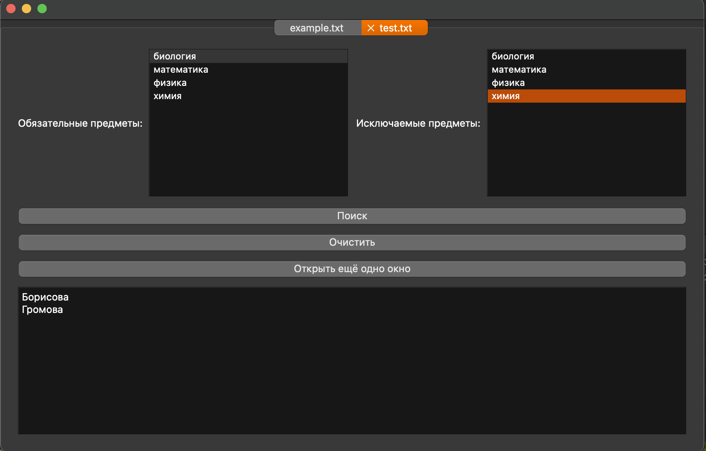

## Требования к задаче
1. Ядро приложения работает с использованием контейнеров и алгоритмов STL
2. Отсутствие С-конструкций в коде (использование вместо них конструкций С++)
3. Удобный интерфейс на базе MFC (QT, GDK…)
4. Система логирования, сохраняющая всю активность приложения и пользователя в файл формата (время, важность, текст сообщения)
5. Обработка исключений, защита от дурака

## Описание варианта задачи
Имеется список 40 студентов, изучающих математику, физику, биологию и химию, заданный в файле в виде строк

*Фамилия*    *предмет*

Каждый предмет изучает около 20 студентов. Разработать структуры данных, позволяющих эффективно отвечать на запросы вида «Выдать всех студентов, изучающих биологию и химию, но не изучающих физику».

## Примечания
- для сборки в проекте используется qmake

## Пример работы
